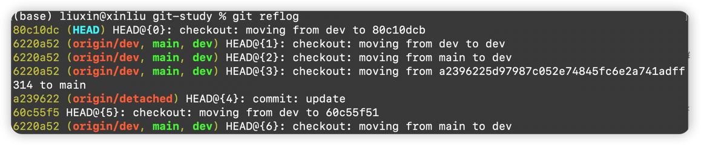

import Tabs from '@theme/Tabs';
import TabItem from '@theme/TabItem';


## fetch
:::tip
git fetch 用来获取远程仓库最新更新信息，包括新的提交、分支、标签等，但这不会自动更新你的本地工作目录，仅会影响 .git 目录
:::

```js
git fetch origin#origin是远程仓库,后面还可以指定具体的分支
```
## log 查看日志信息
:::info 用法
1. 限制显示的提交数量: `git log -n 2`
2. 查看指定文件的提交记录: `git log <file>`
3. 以ASCII图形化方式显示提交历史: git log --graph,直观显示分支和合并操作，常与--oneline、--decorate结合使用
4. 显示文件变更统计: `git log --stat`，显示每个提交的文件变更统计信息，如修改的文件数量、插入和删除的行数等
5. 查看简洁提交历史: `git log --oneline`,每个提交显示一行，包含简短哈希值和提交信息前几行，便于快速浏览
6. 查看所有提交记录：`git log`

:::
1、获取最新的更新，如果要获取到远程的需要先fetch或者pull
```js
git log origin --pretty=format:"%h %s %ad" --date=relative
```

## diff 查看本地分支和远程分支的差异
```js
git diff origin main#远程仓库main分支与本地的差异
```

## merge 分支合并
:::tip
用于多分支项目开发中将合并到主分支用于发布等。
:::
将dev分支的代码合并到当前所在的main分支：
```js
git merge dev
```

:::warning 注意
在进行merge分支合并的时候可能会出现冲突导致合并失败，这种情况发生的原因有：
- 同一文件同一部分被修改：两个分支对同一个文件同一部分进行了不同的修改
- 文件重命名或删除冲突: dev删除了a.java,main修改了a.java
- 分支移动文件冲突：dev和main同时移动了文件的位置
- 提交历史冲突：两个分支的提交历史发生重叠或交叉
- 多人修改同一文件不同部分但相互影响：虽然不同开发者修改同一文件的不同部分，但如果这些修改相互依赖或存在逻辑关联，合并时也可能出现冲突。例如一个开发者修改了函数的输入参数，另一个开发者修改了该函数的调用逻辑

merge发生冲突的时候git会用特殊标记在文件中标记出，解决冲突的方式是查看代码选择保留的部分。
:::

## checkout 切换分支

```js
git checkout dev
```

## status 查看当前仓库工作目录和暂存区的状态
:::info 功能
- 当前所在分支。
- 哪些文件被修改了但没暂存。
- 哪些文件已暂存准备提交。
- 哪些文件是新创建的，还未被Git跟踪。
- 是否有文件被删除。
- 本地分支与远程跟踪分支是否同步。
:::
常用参数选项：
<Tabs>
  <TabItem value="local" label="查看本地分支" default>
   ```js
    git branch
    ```
  </TabItem>
  <TabItem value="all" label="查看本地和远程分支">
   ```js
       git branch -a
       ```
  </TabItem>
  <TabItem value="remote" label="查看远程分支">
   ```js
       git branch -r
       ```
  </TabItem>
</Tabs>

## reflog
:::info 功能
- 查看操作历史
:::
git reflog




## rebase


## branch 分支管理
:::warning
- 命名规范：避免空格或特殊字符，推荐使用feature/xxx、bugfix/xxx等格式。
- 切换前提交更改：未提交的修改可能阻碍分支切换，需先提交或暂存（git stash）
:::
1. 基于当前分支创建新分支
```js
git branch <branch-name>
#git branch dev
```
2. 从指定提交/分支创建
```shell
git branch <branch-name> <commit-hash-or-branch>
#git branch bugfix v1.2（基于标签v1.2创建一个bugfix分支）
```
3. 创建并切换分支
```js
git checkout -b <branch-name>
#git checkout -b test
```
3. 推送本地分支到远程
```js
git push -u origin <branch-name>
#git push -u origin test
```
4. 从远程分支创建本地分支
```js
git checkout -b <local-branch> origin/<remote-branch>
#git checkout -b dev origin/main
```

5. 创建空分支（无提交历史）
```js
git checkout --orphan <branch-name>
#git checkout --orphan doc
```
6. 查看所有分支
```js
git branch -a #包含远程分支
```
7. 删除分支
```js
git branch -d <branch-name>  # 安全删除
git branch -D <branch-name>  # 强制删除未合并分支
```

## stash
