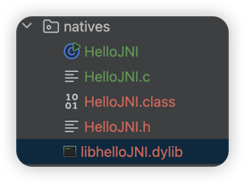

## 前言

环境说明：
- jdk 1.8 x86-64
- mac os arm架构

## 实现步骤
整个代码文件结构如下图所示：


### Java代码中声明一个native方法
>注意⚠️：由于只是学习案例，下面没有指定`package`包，避免后面一堆问题！
```java
public class HelloJNI {
    // 声明Native方法（无实现体）
    public native void sayHello();
    // 静态代码块：加载动态链接库
    static {
        // 库名需与后续生成的库文件名一致（不含扩展名）
        System.loadLibrary("helloJNI");
    }

    public static void main(String[] args) {
        // 调用Native方法
        new HelloJNI().sayHello();
    }
}
```
### 编译生成HelloJNI.class文件
```shell
javac HelloJNI.java
```
### 生成C语言的头文件
运行下面命令后会生成一个`HelloJNI.h`的文件。
```shell
javah -jni  HelloJNI
```
HelloJNI.h头文件的内容如下：
```c
/* DO NOT EDIT THIS FILE - it is machine generated */
#include <jni.h>
/* Header for class HelloJNI */

#ifndef _Included_HelloJNI
#define _Included_HelloJNI
#ifdef __cplusplus
extern "C" {
#endif
/*
 * Class:     HelloJNI
 * Method:    sayHello
 * Signature: ()V
 */
JNIEXPORT void JNICALL Java_HelloJNI_sayHello
  (JNIEnv *, jobject);

#ifdef __cplusplus
}
#endif
#endif

```
### 实现native方法
在同级目录新建一个`HelloJNI.c`的文件，手动添加如下代码实现业务逻辑：
```c
#include <jni.h>
#include "HelloJNI.h"
#include <stdio.h>
//实现sayHello方法业务逻辑
JNIEXPORT void JNICALL Java_HelloJNI_sayHello(JNIEnv *env, jobject obj) {
    printf("Hello from C!\n"); // 简单的打印输出
}
```
### 编译生成动态链接库
这一步非常重要，而且很容易踩坑，需要根据自己当前的操作系统环境以及JVM架构操作（笔者使用的是mac os arm架构）

验证JVM的架构
```shell
root@xilio natives % file $JAVA_HOME/bin/java
/Library/Java/JavaVirtualMachines/jdk1.8.0_202.jdk/Contents/Home/bin/java: Mach-O 64-bit executable x86_64
```

1、Mac OS
>由于本人安装的是`x86_64`的jvm，所以需要编译对应架构的链接库。
```shell
clang -arch x86_64 -I$JAVA_HOME/include -I$JAVA_HOME/include/darwin -shared -o libhelloJNI.dylib HelloJNI.c
```
执行该命令后会生成`libhelloJNI.dylib`的一个链接库文件,通过`file`命令查看架构类型为`x86_64`
```shell
root@xilio natives % file libhelloJNI.dylib 
libhelloJNI.dylib: Mach-O 64-bit dynamically linked shared library x86_64
```
2. Linux
```shell
gcc -shared -fPIC -o libNativeLib.so -I${JAVA_HOME}/include -I${JAVA_HOME}/include/linux HelloJNI.c
```
3. windows
```shell
gcc -shared -o NativeLib.dll -I"%JAVA_HOME%\include" -I"%JAVA_HOME%\include\win32" HelloJNI.c
```
### 运行测试
```shell
root@xilio natives % java -Djava.library.path=. HelloJNI
Hello from C!
```
可以发现已经调用成功了～

