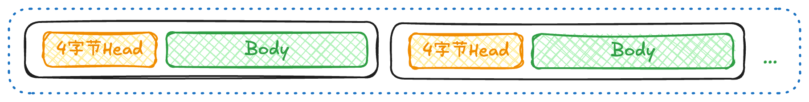

## Netty 基础相关问题

### 讲讲 Netty 的特点？

### Netty 的高性能体现在？

### Netty 的线程模型是什么？

### 什么是 Reactor 模型？

### 说说 Netty 中几个重要的对象是什么，它们之间的关系是什么？

### EventLoop 与 EventLoopGroup 是什么关系？

### Channel 与 Socket 是什么关系，Channel 与 EventLoop 是什么关系，Channel 与 ChannelPipeline 是什么关系？

### 讲讲 Netty 底层操作与 Java NIO 操作对应关系？

### Netty 的 ChannelHandler 为什么需要 @Sharable 注解？

### Spring @PostConstruct 是什么？

### 计算机网络中MTU、MSS是什么？

### 断线重连策略（指数退避算法）
指数退避算法(Exponential Backoff)是处理**断线重连**的经典策略，它通过**逐步增加重连间隔时间**来避免网络**恢复初期**的**大量重试请求**导致服务器过载。

基本思想：
- 首次重连延迟：较短时间（如1秒）
- 每次重连失败后：延迟时间按指数增长
- 达到最大延迟时间后：保持最大延迟不变
- 重连成功后：重置延迟时间

优势：
- 避免网络刚恢复时的"惊群效应"
- 减少不必要的重试请求
- 平衡及时性和系统负载

**连接状态处理：**
- 连接成功时重置计数器
- 连接失败时递增计数器并计算下次重连时间
- 达到最大重试次数后优雅关闭
```java
public class ReconnectClient {
    private final String host;
    private final int port;
    //最大重试次数 超过以后优雅关闭workerGroup
    private final int maxRetries;
    //最大延迟时间 如果超过了则取maxDelaySec为最大延迟时间
    private final long maxDelaySec;

    private Bootstrap bootstrap;
    private EventLoopGroup workerGroup;
    //当前重试次数
    private AtomicInteger retryCount = new AtomicInteger(0);

    public ReconnectClient(String host, int port, int maxRetries, long maxDelaySec) {
        this.host = host;
        this.port = port;
        this.maxRetries = maxRetries;
        this.maxDelaySec = maxDelaySec;
        initBootstrap();
    }

    private void initBootstrap() {
        workerGroup = new NioEventLoopGroup();
        bootstrap = new Bootstrap();
        bootstrap.group(workerGroup).channel(NioSocketChannel.class)
                .handler(new ChannelInitializer<SocketChannel>() {
                    @Override
                    protected void initChannel(SocketChannel ch) {
                        ChannelPipeline pipeline = ch.pipeline();
                        pipeline.addLast(new IdleStateHandler(0, 0, 30));
                        pipeline.addLast(new ReconnectHandler(ReconnectClient.this));
                    }
                });
    }

    public void connect() {
        ChannelFuture future = bootstrap.connect(host, port);
        future.addListener((ChannelFutureListener) f -> {
            if (!f.isSuccess()) {
                System.err.println("连接失败，准备重连...");
                scheduleReconnect();
            } else {
                System.out.println("连接成功!");
                retryCount.set(0); // 重置重试计数器
            }
        });
    }

    private void scheduleReconnect() {
        if (retryCount.get() >= maxRetries) {
            System.err.println("达到最大重试次数，停止重连");
            workerGroup.shutdownGracefully();
            return;
        }

        // 计算退避时间 (2^n秒，最大不超过maxDelaySec)
        int retries = retryCount.getAndIncrement();
        //指数计算，如果超过了最大延迟时间，则取最大延迟时间
        long delay = Math.min((1L << retries), maxDelaySec);
        System.out.printf("第%d次重连将在%d秒后执行...%n", retries + 1, delay);
        // 调度重连任务
        //使用EventLoop的定时任务功能，避免创建额外线程
        workerGroup.schedule(() -> {
            System.out.println("执行重连...");
            connect();
        }, delay, TimeUnit.SECONDS);
    }

    public static void main(String[] args) {
        ReconnectClient client = new ReconnectClient("127.0.0.1", 8080, 10, 60);
        client.connect();
    }
}
//可选，根据业务选择
class ReconnectHandler extends ChannelInboundHandlerAdapter {
    private final ReconnectClient client;

    public ReconnectHandler(ReconnectClient client) {
        this.client = client;
    }
    //服务端断开连接的时候尝试重连接，但是需要结合业务，有的场景不可以在此处处理重新连接！！！
    @Override
    public void channelInactive(ChannelHandlerContext ctx) {
        System.out.println("连接断开，准备重连...");
        ctx.channel().eventLoop().schedule(() -> {
            client.connect();
        }, 1, TimeUnit.SECONDS); // 立即重连
    }

    @Override
    public void exceptionCaught(ChannelHandlerContext ctx, Throwable cause) {
        cause.printStackTrace();
        ctx.close();
    }
}
```
**高级优化方案：**

1、为避免多个客户端同步重连，可以在退避时间中加入随机因子
```java
// 在计算delay时加入随机抖动(±30%)
long jitter = (long)(delay * 0.3 * (Math.random() * 2 - 1));
delay = Math.min(delay + jitter, maxDelaySec);
```
2、结合IdleStateHandler实现心跳机制，在发现连接空闲时主动重连
```java
@Override
public void userEventTriggered(ChannelHandlerContext ctx, Object evt) {
    if (evt instanceof IdleStateEvent) {
        System.out.println("检测到连接空闲，主动关闭并重连...");
        ctx.channel().close().addListener(future -> client.connect());
    }
}
```
### 流量整形（TrafficShapingHandler）

### SSL和TLS有什么区别
**注意：SSL 3.0存在重大安全漏洞，已经弃用！**

TLS是从SSL3.0基础上改进而来的，是SSL的**继承者**，安全性更高，支持更多的加密算法，同时TLS1.3大幅度减少了握手次数提升了性能，目前TLS的行业标准是**TLS 1.2**和**TLS1.3**版本。

单向认证案例：

1、客户端
```java
// 加载服务端的信任证书
File trustCertFile = new File("server_cert.pem");
// 配置支持 TLS 1.3 的 SSL 上下文
SslContext sslContext = SslContextBuilder.forClient()
        .trustManager(trustCertFile) // 信任服务端证书
        .protocols("TLSv1.3") // 指定使用 TLS 1.3
        .build();

// 添加 SSL 处理器
pipeline.addLast(sslContext.newHandler(ch.alloc()));
```
2、服务端
```java
// 加载服务端证书和私钥
File certFile = new File("server_cert.pem");
File keyFile = new File("server_key.pem");

// 配置支持 TLS 1.3 的 SSL 上下文
SslContext sslContext = SslContextBuilder.forServer(certFile, keyFile)
        .protocols("TLSv1.3") // 指定使用 TLS 1.3
        .build();

// 添加 SSL 处理器
pipeline.addLast(sslContext.newHandler(ch.alloc()));
```
如果需要实现双向认证，需要将客户端认证代码改为：
```java
// 加载客户端证书和私钥
File clientCert = new File("client_cert.pem");
File clientKey = new File("client_key.pem");

// 加载服务端证书（用于验证服务端）
File serverCert = new File("server_cert.pem");

// 配置 SSL 上下文
SslContext sslContext = SslContextBuilder.forClient()
        .keyManager(clientCert, clientKey) // 客户端证书和私钥
        .trustManager(serverCert) // 信任服务端证书
        .protocols("TLSv1.3") // 指定使用 TLS 1.3
        .build();
```
证书密钥生成工具可采用：openssl

## Java NIO 相关问题

### BIO、NIO 和 AIO 的区别？

### NIO 的组成是什么？

### 如何使用 Java NIO 搭建简单的客户端与服务端实现网络通讯？

### 如何解决 JDK NIO 的空轮询 Bug？

### Select、Poll、Epoll 的区别？


### 如何实现断线重连

1、方法一：监听ChannelHandler#**channelInactive**方法，在断开连接的时候会调用此方法，可以在该方法中通过`固定时间间隔`、
`指数退避策略`、`无限重试`等逻辑实现重连服务器

2、方法二：在bootstrap中添加监听器实现重连，如：

```java
Bootstrap bootstrap = new Bootstrap();
bootstrap.

group(new NioEventLoopGroup())
        .

channel(NioSocketChannel .class)
         .

handler(new ChannelInitializer<SocketChannel>() {
    @Override
    protected void initChannel (SocketChannel ch) throws Exception {
                ...
    }
});

ChannelFuture future = bootstrap.connect("localhost", 8080);
future.

addListener((ChannelFutureListener) f ->{
        if(!f.

isSuccess()){
        System.out.

println("连接失败，正在重试。..");
        f.

channel().

eventLoop().

schedule(() ->bootstrap.

connect("localhost",8080), 5,TimeUnit.SECONDS);
        }
        });
```

3、方法三：组合心跳机制，在HeartbeatHandler中实现重连服务器。

```java
pipeline.addLast(new IdleStateHandler(0, 0,5,TimeUnit.SECONDS)); // 5 秒读写空闲检测
        pipeline.

addLast(new HeartbeatHandler());
```

### Netty是如何实现心跳机制的？原理是什么？

采用IdleStateHandler处理器实现，该处理器内置了3个空闲超时定时任务线程分别处理3种状态，分别是`读空闲`、`写空闲`、`读写空闲`
，当检测到超时的时候就回触发相应的事件，并将事件传递到下一个handler，用户可以在
自定义的handler中通过重写#userEventTriggered方法监听事件进行业务处理。

```java 
public enum IdleState {
    /**
     * 一段时间没有收到任何数据。
     */
    READER_IDLE,
    /**
     * 一段时间没有发送数据。
     */
    WRITER_IDLE,
    /**
     * 一段时间没有收到或发送任何数据。
     */
    ALL_IDLE
}
```

```java

@Override
public void userEventTriggered(ChannelHandlerContext ctx, Object evt) {
    if (evt instanceof IdleStateEvent) {
        IdleStateEvent event = (IdeStateEvent) evt;
        if (event.state() == IdleState.READER_IDLE) {
            ctx.close(); //如读超时关闭连接
        }
        //或写超时发送ping心跳信息ctx.write().writeAndFlush("PING\n")
    }
}
```

### NioEventLoopGroup 默认的构造函数会起多少线程？

如果用户没有指定线程数，默认会创建**2*cpu核心数**，例如4核cpu就会默认创建8个线程，源码如下：

```java showLineNumbers
public abstract class MultithreadEventLoopGroup extends MultithreadEventExecutorGroup implements EventLoopGroup {
    private static final int DEFAULT_EVENT_LOOP_THREADS;

    static {
        //采用max是为了健壮性考虑，避免极端场景如虚拟环境、容器限制等场景出现0，实际不会有0核的cpu
        DEFAULT_EVENT_LOOP_THREADS = Math.max(1, SystemPropertyUtil.getInt(
                "io.netty.eventLoopThreads", NettyRuntime.availableProcessors() * 2));
    }
}
```

## 粘包与半包相关问题

### 什么是粘包与半包问题？

### 粘包与半包为何会出现？

### Netty 框架本身存在粘包半包问题？

### 什么时候需要考虑粘包与半包问题？

### 如何避免粘包与半包问题？

### Netty 如何解决拆包和粘包问题？

### 如何使用包定长 FixedLengthFrameDecoder 解决粘包与半包问题？原理是什么？

### 如何使用包分隔符 DelimiterBasedFrameDecoder 解决粘包与半包问题？原理是什么？

### 使用 Netty 作为网络通讯时候是如何避免粘包与半包问题？

### 如何自定义任务

特别注意：在handler上下文中添加的自定义任务是在**同一个线程**中执行，意味着对于多个任务将会**串行执行**！

```java

@Override
public void channelRead(ChannelHandlerContext ctx, Object msg) { // (2)
    ctx.channel().eventLoop().execute(new Runnable() {
        @Override
        public void run() {
            Thread.sleep(1 * 10000);//1秒后执行
            System.out.println("task 1");
        }
    });
    ctx.channel().eventLoop().execute(new Runnable() {
        @Override
        public void run() {
            Thread.sleep(2 * 10000);
            System.out.println("task 2"); //30秒后执行
        }
    });
}
```

## Netty 零拷贝相关问题

### 说说对于 Netty 的零拷贝理解？

### Netty 零拷贝体现在哪里？

## WebSocket 协议开发相关问题

### 讲讲如何实现 WebSocket 长连接？

### 讲讲 WebSocket 帧结构的理解？

### 浏览器、服务器对 WebSocket 的支持情况？

### 如何使用 WebSocket 接收和发送广播信息？

### 如何使用 WebSocket 接收和发送二进制信息？

## Netty 源码分析相关问题

### 服务端如何进行初始化？

### 何时接受客户端请求？

### 何时注册接受 Socket 并注册到对应的 EventLoop 管理的 Selector？

### 客户端如何进行初始化？

### 何时创建的 DefaultChannelPipeline？

## TCP 连接与序列化协议相关问题

### TCP 的长连接和短连接？

### 有哪些序列化协议？

### ChannelPipeline的inbound/outbound事件传播机制
### ChannelHandlerContext的传播逻辑
### NioEventLoop事件循环流程
### 内存泄漏检测原理（ResourceLeakDetector）


## 应用项目设计相关

### 如何设计一个Java对象池，减少GC和内存分配消耗

### 如何设计一个内存池，或者内存分配器

### 如何用netty处理http请求实现增删改查

核心处理器：

- HttpServerCodec 编解码
- HttpObjectAggregator 消息聚合
- ChunkedWriteHandler 大文件支持 数据切割
- HttpRequestHandler（自定义用于处理自己业务的处理器）

```java
 public class HttpRequestHandler extends SimpleChannelInboundHandler<FullHttpRequest> {
    @Override
    protected void channelRead0(ChannelHandlerContext ctx, FullHttpRequest request) {
        //...
        //FullHttpResponse用于构建响应 例如返回数据 响应头等
    }
}
```


## 性能优化相关

### 内存优化-对象池化（Recycler）

源码应用：ByteBuf

### 内存优化-DirectBuffer vs HeapBuffer
### 零拷贝-FileRegion文件传输
### 零拷贝-CompositeByteBuf合并缓冲
### 锁优化（无锁化设计）
### Promise与Future异步编程
### 避免ChannelHandler阻塞（业务线程池）


### 如何自定义编解码器，详细说一下

  TCP是以流的方式进行字节传输的，所以无法知道数据的边界，也就意味着无法区分出单个字符，比如一段二进制由于没有边界，客户端收到以后随意截取就会导致数据错乱，不是期望收到的数据。

**下面一段代码是一个基本的解码器的案例：**
```java
public class CustomDecoder extends ByteToMessageDecoder {
    @Override
    protected void decode(ChannelHandlerContext ctx, ByteBuf in, List<Object> out) throws Exception {
        if (in.readableBytes() < 4) return; // 检查是否有足够的字节读取长度字段 【1】
        int length = in.readInt(); // 读取4字节的长度字段 【2】
        if (in.readableBytes() < length) {  //【3】
            in.resetReaderIndex(); // 数据不足，重置读取位置 【4】
            return;
        }
        ByteBuf frame = in.readBytes(length); // 读取消息体【5】
        out.add(frame); // 输出到下游 【6】
    }
}
```
代码详解：

【1】`in.readableBytes() < 4`

这段代码的效果是从TCP流中读取4个字节（想象从TCP流的最开始位置），这4个字节是用来记录后面Body数据的长度的，这样就可以确定后面数据的边界，确定后面的数据边界以后，通过偏移量就可以得到下一个Head，通过Head又可以得到后面Body的长度，
以此类推，这样一来字节流就形成了边界，就可以组装成正确的数据了；那为什么是4而不是其他的呢？其实也可以是其他的（比如2、8字节等），因为4字节可以记录的长度在java中是32位，已经可以得到足够大的整数了，几乎可以满足所有的场景，这也是一个折中的选择
如果用2字节表示的长度又太小，后面的Body内容实际可能很长，如果用8字节，那可能没必要，因为后面的Body大多数场景实际的数据没有那么长，如果用8的话就会造成浪费，完全没必要，所以这就是为什么要用4的原因。

【2】`in.readInt()`

这段代码的效果是读取4字节（我们规定的是4字节表示头），可以读取到一个整数表示后面Body的长度，连续读取该长度就可以得到一个正常的数据。

【3】`in.readableBytes() < length`

通过Head头我们知道后面Body应该读取多少长度的数据，但是由于TCP基于流的，可能会将一个很长的消息进行拆分传输，导致没有收到完整的的数据，也就是常常说的半包问题，
因此需要做一个判断，等下次数据满足Head要读取的长度后再读取。

【4】`in.resetReaderIndex() `
将索引恢复到上次的位置，不然下次读取就会错乱，原因在于调用`in.readableBytes()`会导致索引先后移动，竟然这次都没有读取成本，肯定要恢复。

【5】`in.readBytes(length)`

终于可以读取指定长度（来自Head）的字节数量了，得到的就是实际的Body内容，也就是发送者单次实际发送的数据。
